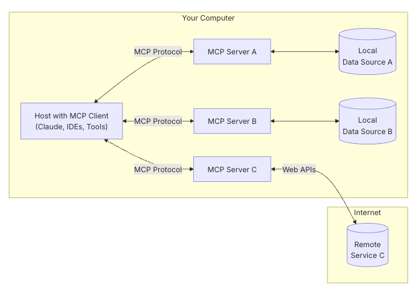
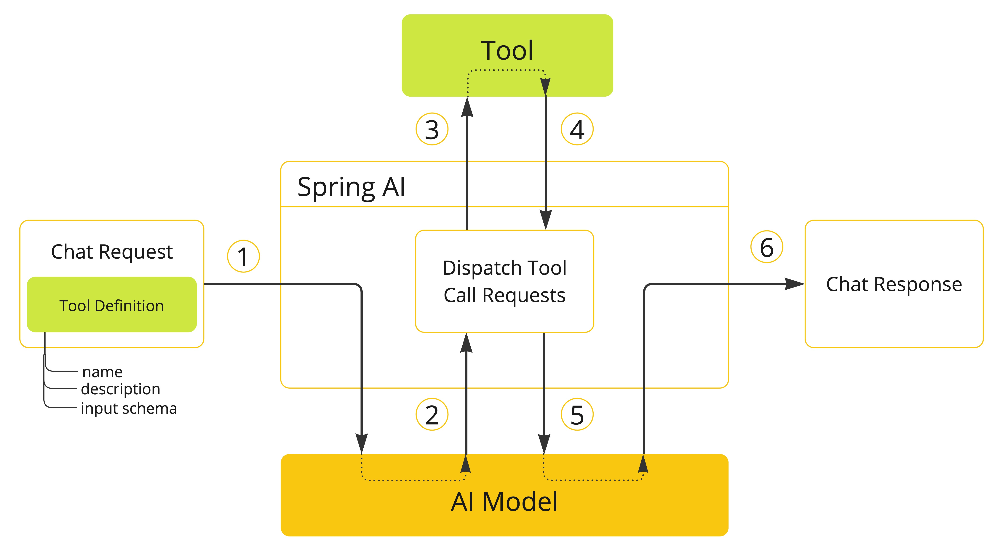
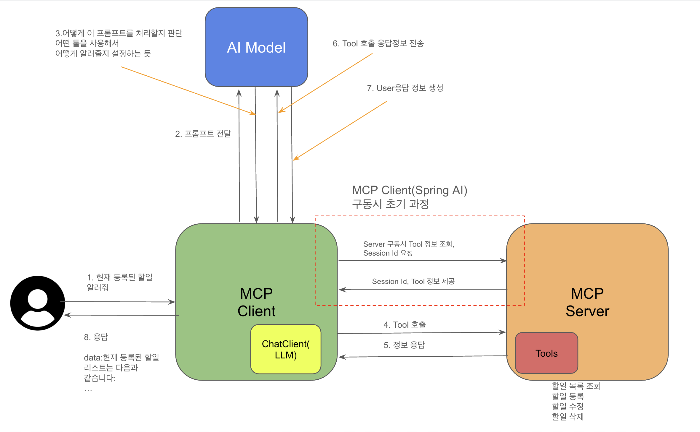

# MCP Server Example using Spring AI

## 개요

MCP(Model Context Protocol)는 AI 모델과 클라이언트 간의 상호작용을 위한 프로토콜입니다. 이 예제는 Spring AI를 사용하여 MCP 서버를 구현하는 방법을 보여줍니다.

### MCP

MCP는 애플리케이션이 LLM에 컨텍스트를 제공하는 방식을 표준화하는 개방형 프로토콜입니다.

Architecture는 다음과 같은 구성 요소로 이루어져 있습니다.


* MCP 호스트 : MCP를 통해 데이터에 액세스하려는 Claude Desktop, IDE 또는 AI 도구와 같은 프로그램
* MCP 클라이언트 : 서버와 1:1 연결을 유지하는 프로토콜 클라이언트
* MCP 서버 : 표준화된 모델 컨텍스트 프로토콜을 통해 각각 특정 기능을 노출하는 경량 프로그램
* 로컬 데이터 소스 : MCP 서버가 안전하게 액세스할 수 있는 컴퓨터의 파일, 데이터베이스 및 서비스
* 원격 서비스 : MCP 서버가 연결할 수 있는 인터넷(예: API를 통해)을 통해 사용 가능한 외부 시스템

[출처](https://modelcontextprotocol.io/introduction)

### 짧은 배경지식

#### 프롬프트

ChatGPT API는 프롬프트 내에 여러 텍스트 입력을 제공하며, 각 텍스트 입력에는 역할이 할당됩니다. 예를 들어, 모델에 동작 방식을 지정하고 상호작용의 컨텍스트를 설정하는 시스템 역할이 있습니다. 또한
일반적으로 사용자의 입력인 사용자 역할도 있습니다.

효과적인 프롬프트를 만드는 것은 예술이자 과학입니다. ChatGPT는 인간 대화를 위해 설계되었습니다. 이는 SQL과 같은 도구를 사용하여 "질문을 하는" 것과는 상당히 다릅니다. 다른 사람과 대화하는 것처럼 AI
모델과 소통해야 합니다.

#### 임베딩

임베딩은 입력 내용 간의 관계를 포착하는 텍스트, 이미지 또는 비디오의 숫자적 표현입니다.
임베딩은 텍스트, 이미지, 비디오를 벡터라고 하는 부동 소수점 배열로 변환하여 작동합니다. 이 벡터는 텍스트, 이미지, 비디오의 의미를 포착하도록 설계되었습니다. 임베딩 배열의 길이를 벡터의 차원이라고 합니다.
두 텍스트의 벡터 표현 간의 수치적 거리를 계산함으로써, 애플리케이션은 임베딩 벡터를 생성하는 데 사용된 객체 간의 유사성을 판단할 수 있습니다.

#### 토큰

토큰은 AI 모델이 작동하는 방식의 기본 요소입니다. 입력 시 모델은 단어를 토큰으로 변환하고, 출력 시 토큰을 다시 단어로 변환합니다.
영어에서 토큰 하나는 단어의 약 75%에 해당합니다. 참고로, 셰익스피어 전집은 약 90만 단어로 이루어져 있으며, 약 120만 개의 토큰으로 해석됩니다.
아마도 더 중요한 것은 토큰 = 돈이라는 점입니다. 호스팅 AI 모델의 경우, 요금은 사용된 토큰 수에 따라 결정됩니다. 입력과 출력 모두 전체 토큰 수에 영향을 미칩니다.

#### 구조화된 출력

AI 모델의 출력은 전통적으로 java.lang.StringJSON 형식으로 응답을 요청하더라도 . 형식으로 제공됩니다. 올바른 JSON 형식일 수는 있지만, JSON 데이터 구조가 아닙니다. 문자열일 뿐입니다.
또한 프롬프트에 "JSON 형식"을 요청하는 것은 100% 정확하지 않습니다.

이런 복잡한 작업으로 인해 의도한 출력을 산출하는 프롬프트를 생성하고, 그 결과로 나온 간단한 문자열을 애플리케이션 통합에 사용할 수 있는 데이터 구조로 변환하는 전문 분야가 생겨났습니다.
구조화 된 출력 변환은 꼼꼼하게 만들어진 프롬프트를 사용하며, 원하는 형식을 얻기 위해 모델과 여러 번 상호 작용해야 하는 경우가 많습니다.

#### AI 모델에 데이터 및 API 가져오기

AI 모델에 아직 훈련되지 않은 정보를 어떻게 제공할 수 있을까?

GPT 3.5/4.0 데이터 세트는 2021년 9월까지만 유효합니다. 따라서 이 모델은 해당 날짜 이후의 지식이 필요한 질문에 대한 답을 알지 못한다고 합니다. 흥미로운 점은 이 데이터 세트의 용량이 약
650GB라는 것입니다.

미세 조정 : 이 전통적인 머신 러닝 기법은 모델을 조정하고 내부 가중치를 변경하는 것을 포함합니다. 하지만 머신 러닝 전문가에게는 까다로운 과정이며, GPT와 같은 모델의 경우 크기가 크기 때문에 리소스가 매우
많이 소모됩니다. 또한, 일부 모델은 이 옵션을 제공하지 않을 수도 있습니다.

프롬프트 스터핑 : 더 실용적인 대안은 모델에 제공된 프롬프트 내에 데이터를 임베드하는 것입니다. 모델의 토큰 제한을 고려할 때, 모델의 컨텍스트 창 내에 관련 데이터를 표시하는 기술이 필요합니다. 이러한 접근
방식을 흔히 "프롬프트 스터핑"이라고 합니다. Spring AI 라이브러리는 "프롬프트 스터핑" 기법, 즉 검색 증강 생성(RAG)을 기반으로 솔루션을 구현할 수 있도록 지원합니다 .

도구 호출 : 이 기술을 사용하면 대규모 언어 모델을 외부 시스템 API에 연결하는 도구(사용자 정의 서비스)를 등록할 수 있습니다. Spring AI는 도구 호출을 지원하기 위해 작성해야 하는 코드를 크게
간소화합니다 .

#### 검색 증강 생성

정확한 AI 모델 응답을 위해 관련 데이터를 프롬프트에 통합하는 과제를 해결하기 위해 검색 증강 생성(RAG)이라는 기술이 등장했습니다.

이 접근 방식은 일괄 처리 방식의 프로그래밍 모델을 사용하는데, 작업에서는 문서에서 비정형 데이터를 읽어 변환한 후 벡터 데이터베이스에 저장합니다. 이는 높은 수준에서 ETL(추출, 변환, 로드) 파이프라인과
같습니다. 벡터 데이터베이스는 RAG 기법의 검색 부분에 사용됩니다.

#### 도구 호출

대규모 언어 모델(LLM)은 학습 후 동결되어 오래된 지식으로 이어지고 외부 데이터에 액세스하거나 수정할 수 없습니다.

도구 호출 메커니즘은 이러한 단점을 해결합니다. 자체 서비스를 도구로 등록하여 대규모 언어 모델을 외부 시스템의 API에 연결할 수 있습니다. 이러한 시스템은 LLM에 실시간 데이터를 제공하고 LLM을 대신하여
데이터 처리 작업을 수행할 수 있습니다.

Spring AI는 도구 호출을 지원하기 위해 작성해야 하는 코드를 크게 간소화합니다. 도구 호출 대화를 자동으로 처리해 줍니다. 도구를 @Tool-annotation이 붙은 메서드로 제공하고 프롬프트 옵션에
추가하여 모델에서 사용할 수 있도록 할 수 있습니다. 또한, 단일 프롬프트에서 여러 도구를 정의하고 참조할 수 있습니다.



모델에서 도구를 사용할 수 있도록 하려면 채팅 요청에 해당 도구의 정의를 포함합니다. 각 도구 정의는 이름, 설명, 그리고 입력 매개변수의 스키마로 구성됩니다.

모델이 도구를 호출하기로 결정하면 정의된 스키마에 따라 모델링된 도구 이름과 입력 매개변수가 포함된 응답을 보냅니다.

애플리케이션은 도구 이름을 사용하여 제공된 입력 매개변수로 도구를 식별하고 실행하는 역할을 합니다.

도구 호출 결과는 애플리케이션에 의해 처리됩니다.

애플리케이션은 도구 호출 결과를 모델로 다시 전송합니다.

모델은 도구 호출 결과를 추가 컨텍스트로 사용하여 최종 응답을 생성합니다.

[출처](https://docs.spring.io/spring-ai/reference/1.0/concepts.html)

### Spring AI로 MCP를 만든다는 것에 대하여

Spring AI는 MCP 서버를 쉽게 구성할 수 있는 기능을 제공합니다. Spring Boot 애플리케이션에 Spring AI 라이브러리를 추가하고, 필요한 의존성을 설정하면 됩니다.

#### MCP Server

MCP Server는 MCP 프로토콜을 사용하여 클라이언트와 서버 간의 상호작용을 처리합니다.

클라이언트에게 현재 가지고 있는 도구가 어떤 것들이 있는지 정의되어 있습니다.

도구라는 것은 앞서 짧은 배경지식에서 소개한 "도구 호출"을 통해 LLM에게 요청할 수 있는 기능을 말합니다. 예를 들어, "조명을 켜다"라는 요청을 LLM에게 전달하면, LLM은 이 요청을 처리하기 위해 등록된
도구를 사용하여 실제 조명을 켜는 작업을 수행합니다.

Spring AI에서는 `@Tool` 어노테이션을 사용하여 도구를 정의합니다. 이 어노테이션은 도구의 이름, 설명, 입력 매개변수의 스키마를 정의합니다.

메서드 수준 주석( `@Tool`)을 사용하여 Spring AI에 도구를 등록할 수 있습니다.

이 도구 등록으로 MCP 클라이언트에서 ChatClient(openAI나 그 밖의 LLM)에게 프롬프트를 작성하여 질의를 하게 되면, 등록된 Tool을 찾아서 판단하고 조합해서 결과를 출력합니다.

```java
class Home {

    @Tool(description = "Turn light On or Off in a room.")
    void turnLight(String roomName, boolean on) {
        // ...
        logger.info("Turn light in room: {} to: {}", roomName, on);
    }
}

String response = ChatClient.create(this.chatModel).prompt()
        .user("Turn the light in the living room On.")
        .tools(new Home())
        .call()
        .content();
```

#### MCP Client

MCP Client는 MCP 서버와 상호작용하는 클라이언트입니다. 클라이언트는 MCP 서버에 요청을 보내고, 서버로부터 응답을 받습니다.
MCP Client에는 Chat Model을 이용하여 프롬프트를 입력받습니다. 따라서 LLM의 API Key 정보등이 필요합니다.

대략적인 다이어그램은 다음과 같다고 생각함 (틀릴 수 있음)


그림에 구성된 방법으로는 SSE(Server Side Event) 과정으로 작성한 내용 입니다.

구성방법은 Stdio 와 SSE 방식으로 나눌 수 있습니다.

[참고](https://docs.spring.io/spring-ai/reference/1.0/api/mcp/mcp-client-boot-starter-docs.html)

#### 공통 내용

properties에 변수들을 입력하면 Auto configuration으로 설정이 됩니다.
Reference에서는 비동기 논블록킹 방식을 선호합니다. 하지만, 비동기 논블록킹 방식은 사용자가 직접 구현해야 하므로, MCP 서버에서는 기본적인 Blocking 방식으로 작성하였습니다.
SSE로 연결하기 위해서는 Protocol 지원이 필요한데, Spring Boot Starter Web은 지원하지 않습니다. 따라서 Webflux 라이브러리를 사용해야 합니다.

## 참고사이트

- [MCP 공식 사이트](https://modelcontextprotocol.io)
- [MCP 서버 Quick Start](https://modelcontextprotocol.io/quickstart/server)
- [MCP 서버 Quick Start(Java)](https://modelcontextprotocol.io/sdk/java/mcp-server)
- [MCP Server Boot Starters](https://docs.spring.io/spring-ai/reference/1.0/api/mcp/mcp-server-boot-starter-docs.html)
- [MCP Client Boot Starters](https://docs.spring.io/spring-ai/reference/1.0/api/mcp/mcp-client-boot-starter-docs.html)
